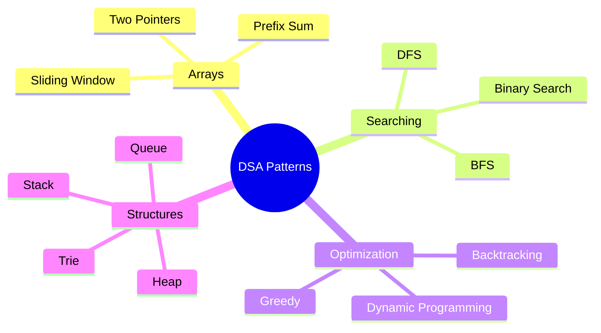
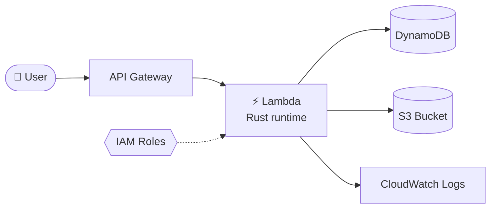
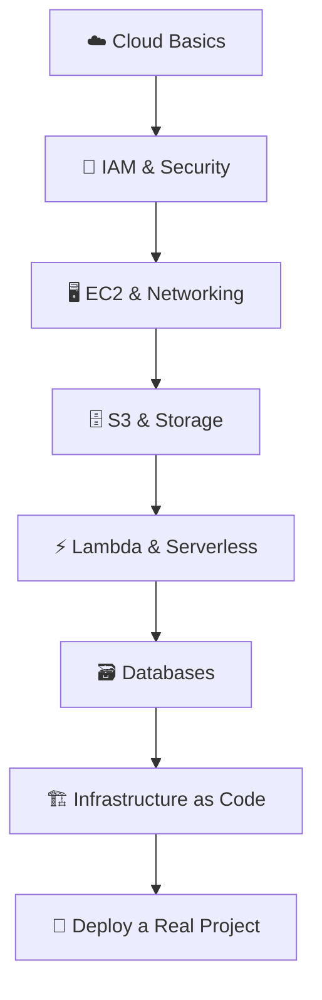
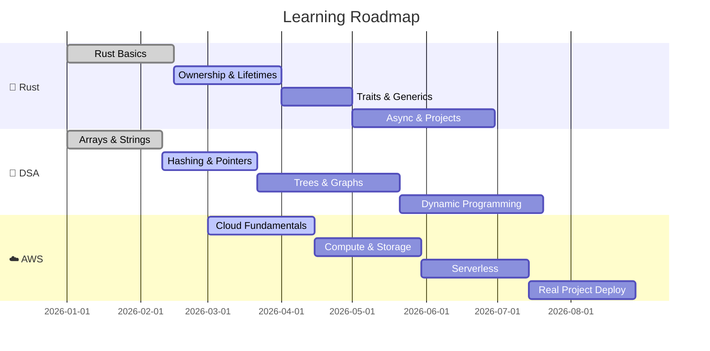

<!-- ============================================================= -->
<!--                    NILAM DEV • PROFILE README                 -->
<!-- ============================================================= -->

<div align="center">


<a href="https://git.io/typing-svg">
  
</a>

<br/>


<br/>


</div>

---

<div align="center">

### 🧭 Quick Navigation

[**About**](#-about-me) •
[**Focus**](#-current-focus) •
[**Rust**](#-rust) •
[**DSA**](#-data-structures--algorithms) •
[**AWS**](#%EF%B8%8F-aws) •
[**Roadmap**](#%EF%B8%8F-2026-roadmap) •
[**Stats**](#-github-stats) •
[**Connect**](#-lets-connect)

</div>

---

## 👨‍💻 About Me

```rust
struct NilamDev {
    name: &'static str,
    location: &'static str,
    role: &'static str,
    languages: Vec<&'static str>,
    practicing: Vec<&'static str>,
    exploring: Vec<&'static str>,
    motto: &'static str,
}

impl NilamDev {
    fn new() -> Self {
        Self {
            name: "Nilam Dev",
            location: "Bihar, India 🇮🇳",
            role: "Network Engineering Enthusiast",
            languages: vec!["Rust 🦀"],
            practicing: vec![
                "Data Structures",
                "Algorithms",
                "Problem Solving",
            ],
            exploring: vec![
                "AWS ☁️",
                "Cloud Architecture",
                "Networking",
                "Serverless",
            ],
            motto: "Learn. Build. Solve. Repeat.",
        }
    }

    fn say_hi(&self) {
        println!("👋 Hi, I'm {}!", self.name);
        println!("📍 Based in {}", self.location);
        println!("🌐 {}", self.role);
        println!("🎯 {}", self.motto);
    }
}

fn main() {
    let me = NilamDev::new();
    me.say_hi();
}

```

---

## 🎯 Current Focus

<table align="center">
<tr>
<td align="center" width="33%">

### 🦀
### **Rust**
Learning ownership, borrowing, lifetimes and writing safe, fast code.


</td>
<td align="center" width="33%">

### 🧩
### **DSA**
Solving problems to sharpen logic, patterns and speed.


</td>
<td align="center" width="33%">

### ☁️
### **AWS**
Exploring compute, storage, security and serverless services.


</td>
</tr>
</table>

---

## 🔭 At a Glance

| 🏷️ Category | 📌 Details |
|:---|:---|
| 🦀 **Learning** | Rust programming language |
| 🧩 **Solving** | Data Structures & Algorithms problems |
| ☁️ **Exploring** | AWS cloud services |
| 🌱 **Growing** | Problem solving, system design basics |
| 🎯 **Goal** | Become a confident systems + cloud developer |
| ⚡ **Fun fact** | I fight the borrow checker daily (and sometimes win) |

---

## 🦀 Rust

> *"Fearless concurrency. Zero-cost abstractions. Memory safety without a garbage collector."*

### 📚 What I'm Learning

- [x] Installing Rust & using `cargo`
- [x] Variables, mutability & data types
- [x] Functions & control flow
- [ ] Ownership, borrowing & references
- [ ] Lifetimes
- [ ] Structs, enums & pattern matching
- [ ] `Option` and `Result` error handling
- [ ] Collections: `Vec`, `HashMap`, `HashSet`
- [ ] Traits & generics
- [ ] Iterators & closures
- [ ] Smart pointers: `Box`, `Rc`, `RefCell`
- [ ] Concurrency with threads & channels
- [ ] Async Rust with `tokio`

### 🧪 Sample: Ownership in Action

```rust
fn main() {
    let s1 = String::from("hello");
    let s2 = s1.clone();          // deep copy, both valid
    println!("{s1} {s2}");

    let len = calculate_length(&s1); // borrow, no move
    println!("'{s1}' has length {len}");
}

fn calculate_length(s: &String) -> usize {
    s.len()
}
```

### 🧪 Sample: Pattern Matching

```rust
enum Shape {
    Circle(f64),
    Rectangle(f64, f64),
    Triangle(f64, f64),
}

fn area(shape: &Shape) -> f64 {
    match shape {
        Shape::Circle(r) => std::f64::consts::PI * r * r,
        Shape::Rectangle(w, h) => w * h,
        Shape::Triangle(b, h) => 0.5 * b * h,
    }
}
```

### 🧪 Sample: Error Handling

```rust
use std::fs;
use std::io;

fn read_file(path: &str) -> Result<String, io::Error> {
    let contents = fs::read_to_string(path)?;
    Ok(contents)
}

fn main() {
    match read_file("notes.txt") {
        Ok(text) => println!("{text}"),
        Err(e) => eprintln!("Oops: {e}"),
    }
}
```

<details>
<summary><b>🧠 Rust Concepts Cheat Sheet (click to expand)</b></summary>

<br/>

| Concept | One-line Summary |
|:---|:---|
| **Ownership** | Every value has exactly one owner; dropped when owner goes out of scope |
| **Borrowing** | `&T` shared reference, `&mut T` exclusive reference |
| **Lifetimes** | Compiler-checked scopes that keep references valid |
| **Traits** | Shared behavior, like interfaces |
| **Generics** | Write code once, use it for many types |
| **Enums** | Types that can be one of several variants |
| **`Option<T>`** | Value that may or may not exist (`Some` / `None`) |
| **`Result<T, E>`** | Success (`Ok`) or failure (`Err`) |
| **Cargo** | Build tool + package manager |
| **Crates** | Rust packages published on crates.io |

</details>

### 🛠️ Rust Project Ideas

| # | Project | Difficulty | Status |
|:-:|:---|:-:|:-:|
| 1 | Guessing Game CLI | 🟢 Easy | ✅ Done |
| 2 | To-Do List CLI | 🟢 Easy | 🚧 Planned |
| 3 | Word Counter (`wc` clone) | 🟡 Medium | 🚧 Planned |
| 4 | Mini `grep` in Rust | 🟡 Medium | 🚧 Planned |
| 5 | Simple HTTP Server | 🟠 Hard | 💡 Idea |
| 6 | Key-Value Store | 🟠 Hard | 💡 Idea |
| 7 | AWS S3 CLI Tool in Rust | 🔴 Advanced | 💡 Idea |

---

## 🧩 Data Structures & Algorithms

> *"Talk is cheap. Show me the code."*

### 🗂️ Topics Tracker

| Topic | Status | Problems Solved |
|:---|:-:|:-:|
| 📦 Arrays | ✅ Done | ▰▰▰▰▰▰▰▱▱▱ |
| 🔤 Strings | ✅ Done | ▰▰▰▰▰▰▱▱▱▱ |
| #️⃣ Hashing | 🚧 In Progress | ▰▰▰▰▱▱▱▱▱▱ |
| 👉 Two Pointers | 🚧 In Progress | ▰▰▰▱▱▱▱▱▱▱ |
| 🪟 Sliding Window | 🚧 In Progress | ▰▰▱▱▱▱▱▱▱▱ |
| 🔗 Linked Lists | ⏳ Upcoming | ▱▱▱▱▱▱▱▱▱▱ |
| 📚 Stacks & Queues | ⏳ Upcoming | ▱▱▱▱▱▱▱▱▱▱ |
| 🔍 Binary Search | ⏳ Upcoming | ▱▱▱▱▱▱▱▱▱▱ |
| 🌳 Trees | ⏳ Upcoming | ▱▱▱▱▱▱▱▱▱▱ |
| 🕸️ Graphs | ⏳ Upcoming | ▱▱▱▱▱▱▱▱▱▱ |
| 🧮 Dynamic Programming | ⏳ Upcoming | ▱▱▱▱▱▱▱▱▱▱ |
| ⛰️ Heaps | ⏳ Upcoming | ▱▱▱▱▱▱▱▱▱▱ |
| 🔙 Backtracking | ⏳ Upcoming | ▱▱▱▱▱▱▱▱▱▱ |

### ⏱️ Big-O Cheat Sheet

| Data Structure | Access | Search | Insert | Delete |
|:---|:-:|:-:|:-:|:-:|
| Array | O(1) | O(n) | O(n) | O(n) |
| Linked List | O(n) | O(n) | O(1) | O(1) |
| Stack | O(n) | O(n) | O(1) | O(1) |
| Queue | O(n) | O(n) | O(1) | O(1) |
| Hash Table | N/A | O(1) avg | O(1) avg | O(1) avg |
| Binary Search Tree | O(log n) | O(log n) | O(log n) | O(log n) |
| Heap | O(1) top | O(n) | O(log n) | O(log n) |

| Algorithm | Best | Average | Worst |
|:---|:-:|:-:|:-:|
| Binary Search | O(1) | O(log n) | O(log n) |
| Bubble Sort | O(n) | O(n²) | O(n²) |
| Merge Sort | O(n log n) | O(n log n) | O(n log n) |
| Quick Sort | O(n log n) | O(n log n) | O(n²) |
| BFS / DFS | O(V+E) | O(V+E) | O(V+E) |

### 🧪 Sample: Two Sum in Rust

```rust
use std::collections::HashMap;

/// Returns indices of two numbers that add up to `target`.
/// Time: O(n)  |  Space: O(n)
pub fn two_sum(nums: Vec<i32>, target: i32) -> Option<(usize, usize)> {
    let mut seen: HashMap<i32, usize> = HashMap::new();

    for (i, &num) in nums.iter().enumerate() {
        let complement = target - num;
        if let Some(&j) = seen.get(&complement) {
            return Some((j, i));
        }
        seen.insert(num, i);
    }
    None
}

fn main() {
    let result = two_sum(vec![2, 7, 11, 15], 9);
    println!("{:?}", result); // Some((0, 1))
}
```

### 🧪 Sample: Binary Search in Rust

```rust
/// Time: O(log n)  |  Space: O(1)
pub fn binary_search(arr: &[i32], target: i32) -> Option<usize> {
    let (mut low, mut high) = (0usize, arr.len());

    while low < high {
        let mid = low + (high - low) / 2;
        if arr[mid] == target {
            return Some(mid);
        } else if arr[mid] < target {
            low = mid + 1;
        } else {
            high = mid;
        }
    }
    None
}
```

### 🧪 Sample: Reverse a Linked List (concept)

```rust
#[derive(Debug)]
struct ListNode {
    val: i32,
    next: Option<Box<ListNode>>,
}

fn reverse_list(head: Option<Box<ListNode>>) -> Option<Box<ListNode>> {
    let mut prev = None;
    let mut curr = head;

    while let Some(mut node) = curr {
        curr = node.next.take();
        node.next = prev;
        prev = Some(node);
    }
    prev
}
```

### 🎯 Problem-Solving Patterns I'm Learning



### 📈 My Problem-Solving Approach

1. 📖 **Understand** the problem, inputs, outputs, edge cases
2. 🧠 **Brute force** first, then think of optimizations
3. 🔍 **Identify the pattern** (two pointers, hashing, DP, etc.)
4. ✍️ **Write** clean code
5. 🧪 **Test** with edge cases
6. ⏱️ **Analyze** time and space complexity
7. 📝 **Review** and note what I learned

---

## ☁️ AWS

> *"There is no cloud, it's just someone else's computer, but a really, really good one."*

### 🧱 Services I'm Exploring

| Category | Service | What It Does | Status |
|:---|:---|:---|:-:|
| 🖥️ Compute | **EC2** | Virtual servers in the cloud | 🚧 |
| ⚡ Compute | **Lambda** | Run code without managing servers | 🚧 |
| 🗄️ Storage | **S3** | Scalable object storage | ✅ |
| 🔐 Security | **IAM** | Users, roles and permissions | 🚧 |
| 🗃️ Database | **DynamoDB** | Serverless NoSQL database | ⏳ |
| 🗃️ Database | **RDS** | Managed relational databases | ⏳ |
| 🌐 Networking | **VPC** | Your private network in AWS | ⏳ |
| 🌍 Networking | **Route 53** | DNS and domain management | ⏳ |
| 🚪 API | **API Gateway** | Create and manage APIs | ⏳ |
| 📊 Monitoring | **CloudWatch** | Logs, metrics and alarms | ⏳ |
| 🏗️ IaC | **CloudFormation** | Infrastructure as code | ⏳ |

### 🏛️ Architecture I'm Working Toward



### 🔄 Learning Path



### 💡 AWS + Rust = ❤️

Rust is a great fit for the cloud: tiny binaries, fast cold starts, and low memory usage.

```rust
// Idea: a Lambda function written in Rust
use lambda_runtime::{service_fn, Error, LambdaEvent};
use serde_json::{json, Value};

async fn handler(event: LambdaEvent<Value>) -> Result<Value, Error> {
    let name = event.payload["name"].as_str().unwrap_or("world");
    Ok(json!({ "message": format!("Hello, {name}! 🦀☁️") }))
}

#[tokio::main]
async fn main() -> Result<(), Error> {
    lambda_runtime::run(service_fn(handler)).await
}
```

<details>
<summary><b>🔐 AWS Best Practices I'm Keeping in Mind (click to expand)</b></summary>

<br/>

- 🔒 Never use the root account for daily work
- 🔑 Enable **MFA** everywhere
- 🪪 Follow **least privilege** in IAM policies
- 💰 Set up **billing alarms** to avoid surprise costs
- 🧹 Always clean up unused resources
- 🏷️ Tag your resources
- 🚫 Never commit access keys to Git

</details>

---

## 🗺️ 2026 Roadmap



---

## 🏆 Goals

| 🎯 Goal | 📅 Target | 📊 Progress |
|:---|:-:|:-:|
| Solve **300+** DSA problems | End of 2026 | ▰▰▱▱▱▱▱▱▱▱ |
| Build **5** Rust projects | End of 2026 | ▰▱▱▱▱▱▱▱▱▱ |
| Deploy **1** project on AWS | Q4 2026 | ▱▱▱▱▱▱▱▱▱▱ |
| Contribute to **open source** | Q4 2026 | ▱▱▱▱▱▱▱▱▱▱ |
| Write **10** learning blog posts | End of 2026 | ▱▱▱▱▱▱▱▱▱▱ |

---

## 📓 Learning Log

<details open>
<summary><b>📅 Recent Progress</b></summary>

<br/>

| Date | What I Did |
|:---|:---|
| 🗓️ Week 1 | Set up Rust toolchain, wrote first `Hello, World!` 🦀 |
| 🗓️ Week 2 | Solved array & string problems, learned `cargo` |
| 🗓️ Week 3 | Started hashing patterns, created AWS free-tier account |
| 🗓️ Week 4 | Explored S3 and IAM basics |
| 🗓️ Week 5 | Studying ownership and borrowing in depth |

*(Update this log regularly! 📝)*

</details>

---

## 📊 GitHub Stats

<div align="center">


<br/>


<br/>


</div>

---

## 🏅 Achievements

<div align="center">


</div>

---

## 🧰 Tools & Tech

<div align="center">

**Languages**


**Cloud & DevOps**


**Tools**


</div>

---

## 📚 Resources I Love

| Topic | Resource |
|:---|:---|
| 🦀 Rust | [The Rust Book](https://doc.rust-lang.org/book/) |
| 🦀 Rust | [Rust by Example](https://doc.rust-lang.org/rust-by-example/) |
| 🦀 Rust | [Rustlings](https://github.com/rust-lang/rustlings) |
| 🧩 DSA | [LeetCode](https://leetcode.com) |
| 🧩 DSA | [NeetCode](https://neetcode.io) |
| 🧩 DSA | [GeeksforGeeks](https://www.geeksforgeeks.org) |
| ☁️ AWS | [AWS Documentation](https://docs.aws.amazon.com) |
| ☁️ AWS | [AWS Skill Builder](https://skillbuilder.aws) |

---

## 🤝 Open To

- 🦀 Collaborating on Rust projects
- 🧩 DSA study groups & pair problem-solving
- ☁️ Sharing AWS learning tips
- 🌱 Mentorship and feedback

---

## 💬 Ask Me About

**Rust basics • DSA patterns • Getting started with AWS • Learning consistently**

---

## 📫 Let's Connect

<div align="center">

[](https://github.com/nilamdev01)
[](https://linkedin.com/in/nilamdev01)
[](https://x.com/nilamdev01)
[](mailto:your@email.com)
[](https://leetcode.com/nilamdev01)

<br/>

### 💭 *"The best time to start was yesterday. The next best time is now."*

<br/>

**⭐ Thanks for visiting my profile! If you like what you see, drop a star. ⭐**


</div>
